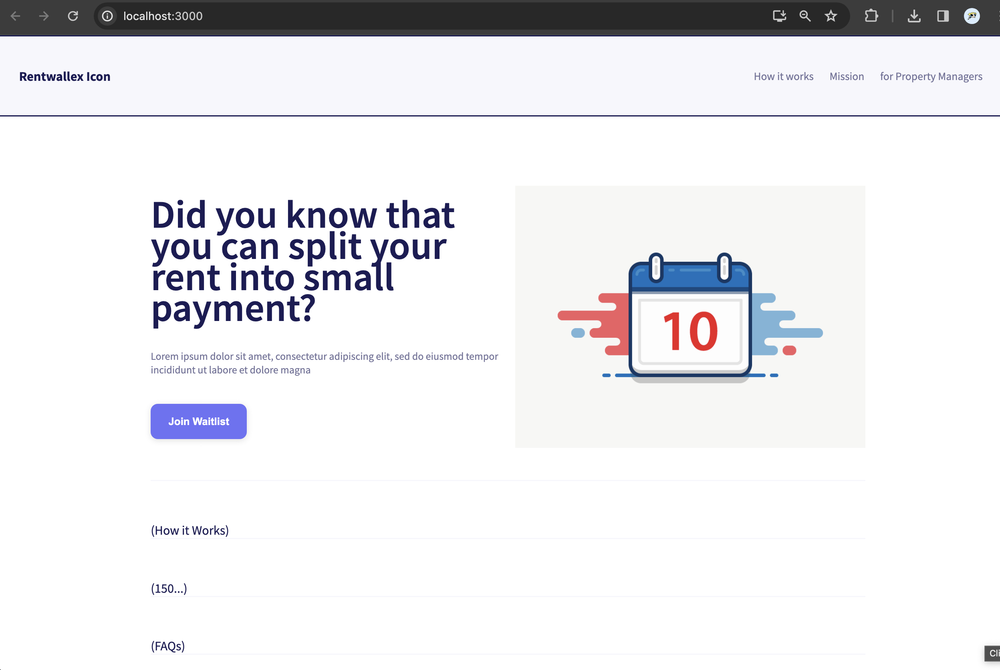

<a name="readme-top"></a>


<!-- PROJECT LOGO -->
<br />
<div align="center">
  Current progress:
  
  

  <h3 align="center">Rentwallex's Landing Page</h3>

  <p align="center">
    todo: add subtitle
    <br />
  </p>
</div>


<!-- TABLE OF CONTENTS -->
<details>
  <summary>Table of Contents</summary>
  <ol>
    <li>
      <a href="#about-the-project">About The Project</a>
      <ul>
        <li><a href="#built-with">Built With</a></li>
      </ul>
    </li>
    <li>
      <a href="#getting-started">Getting Started</a>
      <ul>
        <li><a href="#prerequisites">Prerequisites</a></li>
        <li><a href="#installation">Installation</a></li>
      </ul>
    </li>
    <li><a href="#usage">Usage</a></li>
    <li><a href="#roadmap">Roadmap</a></li>
    <li><a href="#license">License</a></li>
    <li><a href="#contact">Contact</a></li>
    <li><a href="#collaborators">Collaborators</a></li>
    <li><a href="#acknowledgments">Acknowledgments</a></li>
  </ol>
</details>


<!-- ABOUT THE PROJECT -->
## About The Project

todo: enter description about the project

Features:
* todo
* todo
* todo

todo: enter more description about the project, if any

<p align="right">(<a href="#readme-top">back to top</a>)</p>


### Built With

* [React](https://reactjs.org/)


<p align="right">(<a href="#readme-top">back to top</a>)</p>


<!-- GETTING STARTED -->
## Getting Started

These instructions will guide you through the process of setting up and running the React app `client` on your local machine, as well as the backend `server` (not implemented yet). Ensure that you have Node.js and npm installed before proceeding.

### Prerequisites
Frontend (Client):
* Node.js: [Download and install Node.js](https://nodejs.org/en)
* npm (Node Package Manager): npm is included with Node.js installation.

Backend (Server):
* todo


### Installation

1. Clone the repository to your local machine
    ```sh
    git clone https://github.com/charleyoshi/rentwallex.git
    ```
2. For frontend, navigate to the "client" directory.
   ```sh
   cd client
   ```
    1. Install NPM packages
        ```sh
        npm install
        ```
    2. Running the App
       ```sh
       npm start
       ```
        (For more running options, see `readme.md` in `client` folder created by React)


3. For backend: todo

<p align="right">(<a href="#readme-top">back to top</a>)</p>


<!-- USAGE EXAMPLES -->
## Usage
todo
<!--Use this space to show useful examples of how a project can be used. Additional screenshots, code examples and demos work well in this space. You may also link to more resources.-->

<!--_For more examples, please refer to the [Documentation](https://example.com)_-->

<p align="right">(<a href="#readme-top">back to top</a>)</p>


<!-- ROADMAP -->
## Roadmap

- [ ] Landing page 
- [ ] Build buttons, forms, and links 
- [ ] Users can sign up for the waitlist
- [ ] Property managers sign up 
- [ ] The waitlist form that captures emails without names, the amount of their monthly rent, and their area of residence (e.g. zip code)
- [ ] Map integration
- [ ] Users can see a Google map of locations interested in the website
- [ ] A count of users registered for the website


See the [open issues](https://github.com/charleyoshi/rentwallex/issues) for a full list of proposed features (and known issues).

<p align="right">(<a href="#readme-top">back to top</a>)</p>


<!-- LICENSE -->
## License
todo: add license (if needed)
<!-- Distributed under the MIT License. See `LICENSE.txt` for more information. -->

<p align="right">(<a href="#readme-top">back to top</a>)</p>


<!-- CONTACT -->
## Contact

Yemi Ifegbuyi - yemi@cozii.co


<p align="right">(<a href="#readme-top">back to top</a>)</p>


<!-- CONTACT -->
## Collaborators

- Shahil Prasad 
- Charley Yoshi [@charleyoshi](https://github.com/charleyoshi) - charleyoshi2@gmail.com
- Jonathan Ferrer
- Bolaji Ayodele


<p align="right">(<a href="#readme-top">back to top</a>)</p>


<!-- ACKNOWLEDGMENTS -->
## Acknowledgments
* [React](https://create-react-app.dev/)
* [Google Fonts](https://fonts.google.com/icons)

<p align="right">(<a href="#readme-top">back to top</a>)</p>
